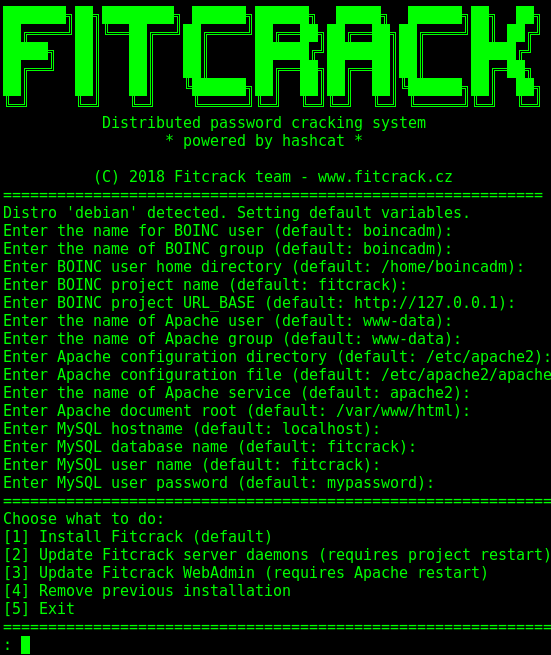

# Fitcrack (Distributed password cracking system)

Note: A detailed documentation and other information can be found at [https://fitcrack.fit.vutbr.cz](https://fitcrack.fit.vutbr.cz)

This README describes how to install and run Fitcrack distributed password cracking system.
There are four ways of deployment:

* Using installer + [Step-by-step guide for Debian 9 / Ubuntu 18.04 LTS](#instdeb) (recommended way)
* Using installer + [Step-by-step guide for CentOS/RHEL 8](#instcentos) (recommended way)
* Using installer + [General installation instructions](#instgen)
* Manual install:
  * For **BOINC and Fitcrack server**, see [server README](server/README.md)
  * For **Fitcrack WebAdmin**, see [WebAdmin README](webadmin/README.md)
  * For **Custom build of Runner**, see [Runner README](runner/README.md)

Once installed:
 * See how to [Operate the server](#oper)
 * See the [Fitcrack's webadmin user guide] (https://nesfit.github.io/fitcrack/#/)

<a name="instgen"></a>
## General installation instructions

### Software prerequisities
* make (3.79+)
* m4 (1.4+)
* libtool (1.5+)
* autoconf (2.58+)
* automake (1.8+)
* GCC (6.3.0+)
* pkg-config (0.15+)
* Perl + libcompress
* Python 2 (2.2+)
* Python 3
* pip for Python 3
* MySQL (4.0.9+) or MariaDB (10.0+)
* libnotify-dev
* Apache with the following modules:
  * PHP (5+) with XML and MySQL modules
  * CGI
  * WSGI
  * rewrite
* PHP5 with cli support and the GD and MySQL modules
* OpenSSL (0.98+)
* Curl
* Gtest (only if you intend to build the tests in server/src/tests)

### Installation
Create a user for running BOINC server
```
useradd -m -c "BOINC Administrator" boincadm  -s /bin/bash
```
Create a MySQL database and user account for Fitcrack
```
mysql -u root -p
mysql> create database fitcrack;
mysql> GRANT ALL PRIVILEGES ON fitcrack.* TO 'fitcrack'@'localhost' IDENTIFIED BY 'mypassword';
```
As root, use Fitcrack installer:
```
./install_fitcrack.sh
```
And proceed according to your preferences...



<a name="instdeb"></a>
## Step-by-step: Install on Debian 9 / Ubuntu 18.04 LTS

Open a **root** terminal, go to the directory with Fitcrack sources and proceed as follows.

### Install prerequisities
```
apt-get install m4 make dh-autoreconf pkg-config git vim apache2 libapache2-mod-php mysql-server mysql-common libmysqlclient-dev zlibc zlib1g zlib1g-dev php php-xml php-mysql php-cli php-gd python python python3 python-mysqldb python3-pymysql python3-pip libapache2-mod-wsgi-py3 libssl-dev libcurl4-openssl-dev apache2-utils libboost1.62-all-dev pkg-config libnotify-dev curl perl libcompress-raw-lzma-perl

mysql_secure_installation # Set MySQL root password

a2enmod cgi       # enable mod CGI
a2enmod rewrite   # enable mod rewrite
a2enmod wsgi      # enable mod wsgi
systemctl restart apache2
```
### Setup user and Database
```
useradd -m -c "BOINC Administrator" boincadm  -s /bin/bash
mysql -u root -p
mysql> create database fitcrack;
mysql> GRANT ALL PRIVILEGES ON fitcrack.* TO 'fitcrack'@'localhost' IDENTIFIED BY 'mypassword';
```

### Install Fitcrack
```
./install_fitcrack.sh
```

<a name="instcentos"></a>
## Step-by-step: Install on CentOS/RHEL 8

Open a **root** terminal, go to the directory with Fitcrack sources and proceed as follows.

### SELINUX
The following tutorial assumes **SELINUX** in permissive or disabled mode.
If you wish to use SELINUX enforcing mode on Fitcrack server machine, you have to configure policies to allow apache access to project directory and others.


### Install prerequisities
```
yum install -y m4 gcc gcc-c++ make libtool autoconf automake git vim httpd php php-xml php-mysqlnd python2 python2-devel python3-devel python3 python2-pip python3-pip python3-mod_wsgi  redhat-rpm-config python3-setuptools mariadb-server mariadb-devel pkgconfig libnotify zlib libcurl-devel openssl-libs openssl-devel

pip2 install mysqlclient
pip3 install mysqlclient

alternatives --set python /usr/bin/python2
```

### Configure exceptions for firewalld:
```
firewall-cmd --zone=public --add-service=http --permanent
firewall-cmd --zone=public --add-service=https --permanent
firewall-cmd --zone=public --add-port=5000/tcp --permanent
firewall-cmd --reload
```

### Configure services
```
systemctl start httpd.service
systemctl enable httpd.service
systemctl start mariadb
mysql_secure_installation # Set MariaDB root password
systemctl enable mariadb.service
```

### Setup user and Database
```
useradd -m -c "BOINC Administrator" boincadm  -s /bin/bash
mysql -u root -p
mysql> create database fitcrack;
mysql> GRANT ALL PRIVILEGES ON fitcrack.* TO 'fitcrack'@'localhost' IDENTIFIED BY 'mypassword';
```

### Install Fitcrack
```
./install_fitcrack.sh
```

<a name="oper"></a>
## Operating the server

The **default** login credentials to the WebAdmin are:
* login: ``fitcrack``
* password: ``FITCRACK``

At the end of the installation, the installer asks you if you wish to start
the server daemons. If you decide not to, you can do that manually as described below:

## Running the server

Login to the server as BOINC user (e.g. `boincadm`) and enter the project directory:
```
boincadm@myserver:~$ cd projects/fitcrack
```

### Get server status
```
boincadm@myserver:~/projects/fitcrack$ ./bin/status
```

### Start Fitcrack server
```
boincadm@myserver:~/projects/fitcrack$ ./bin/start
```

### Stop Fitcrack server
```
boincadm@myserver:~/projects/fitcrack$ ./bin/stop
```
## Optional: workunit pipelining - multiple workunits per hosts

In Fitcrack, it is possible to assign 2 (or more) workunits per node, and make a node compute a single one, while the others are downloading in backgroud. This reduces the overhead for traffic-extensive attacks - e.g. dictionary attack with big dictionaries.

**Newly**, the feature is natively supported in Fitcrack without needing any extra modification on client site. The feature can be configured by the user in the installer and is enabled by default. If you want to change it later, in the project config, e.g. `/home/boincadm/projects/fitcrack/config.xml` in section `<boinc><config>` set:
```
<max_wus_in_progress>1</max_wus_in_progress>
```
to disable the pipelining feature, or
```
<max_wus_in_progress>2</max_wus_in_progress>
```
to activate the pipelining. After modification, you need to restart
the server (as BOINC user):
```
boincadm@myserver:~$ cd projects/fitcrack
boincadm@myserver:~/projects/fitcrack$ ./bin/stop
boincadm@myserver:~/projects/fitcrack$ ./bin/start
```
