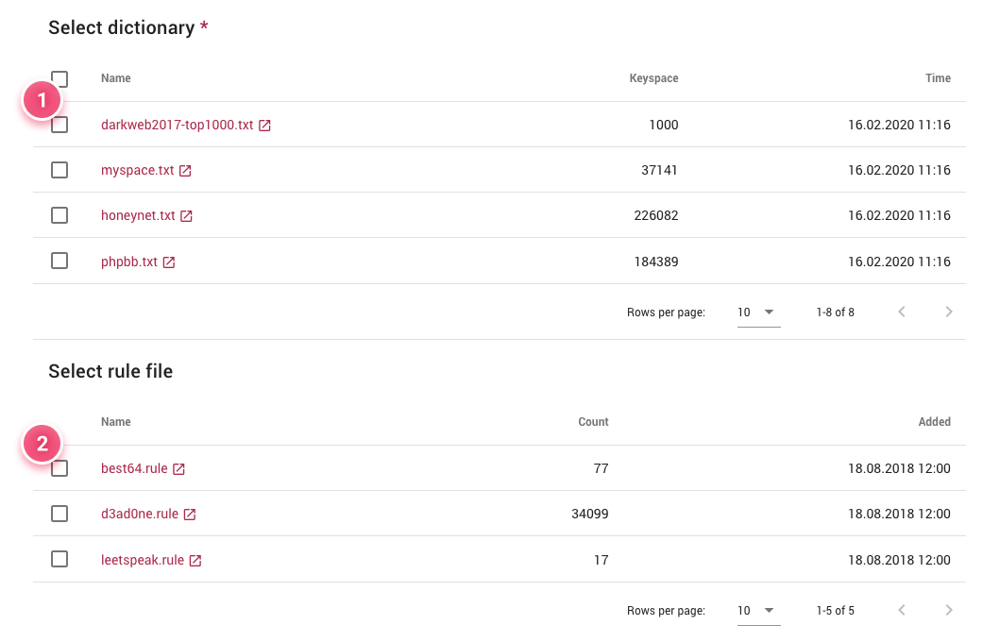
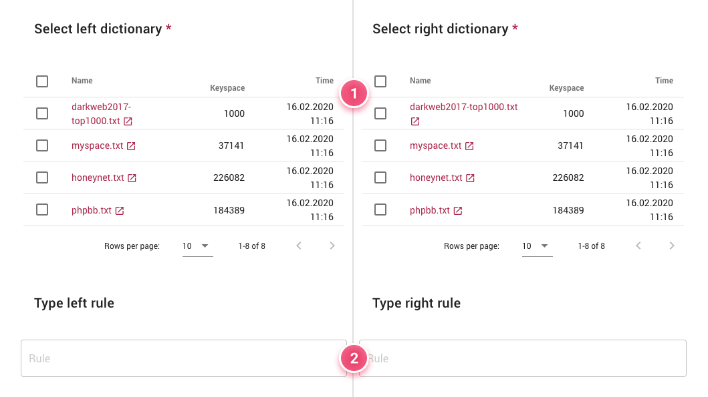
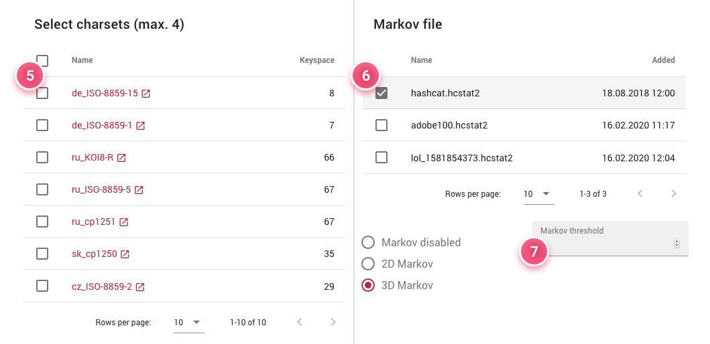
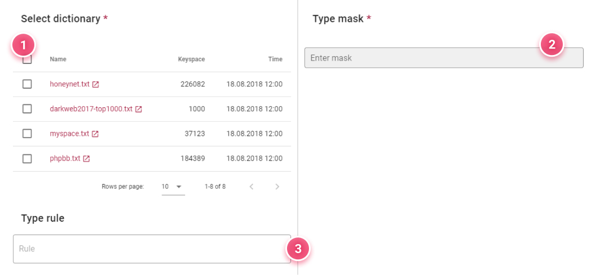
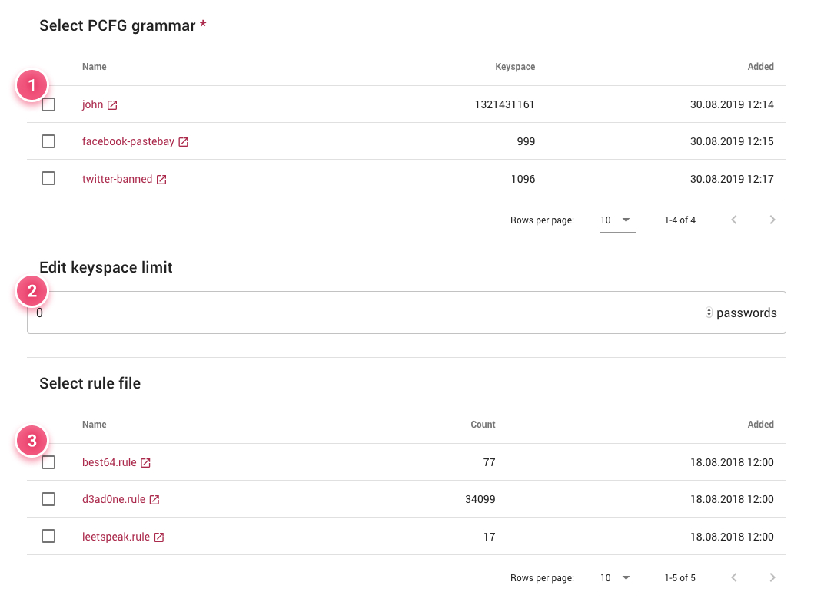

Attack Modes
============

Since Fitcrack uses Hashcat under the hood, it also provides the same attack modes. Attack modes refer to the different ways of cracking the hashes you provide as the job input.

What attack mode to use depends on the job in question, but first, you need to get a feel for what each of them does. In this section, we'll take a closer look at each of the available modes.

Dictionary Attack
-----------------

A dictionary attack will try every possible password from given password dictionaries. You can select one or more dictionaries you want to use using the table __(1)__. For each dictionary available, you can see the keyspace signifying the number of passwords which will be used. If you choose multiple dictionaries, the total keyspace of the job is a sum of keyspaces of all selected dictionaries.

It is also possible to select a file with password-mangling rules from the bottom table __(2)__. The number of rules in each file is shown in the _count_ column. The rules enhance the repertoire of passwords, but they also increase the total keyspace of the job. This is because Fitcrack applies every rule from the rule file to each dictionary password. The total keyspace is calculated as the sum of dictionary keyspaces multiplied by the number of rules in the rule file.

Combination Attack
------------------

The combination attack is based on __combining passwords from two dictionaries__ you select as left and right side __(1)__. Each password from the left dictionary is concatenated with every single password from the right dictionary. Such newly created passwords are then used for cracking.

It is also possible to define password-mangling rules for both sides __(2)__. The left and/or right rule will be applied to every password from the respective dictionary before the concatenation mentioned above happens. Unlike in a dictionary attack, with rules in a combination attack, there is only one rule per dictionary and it is always applied, hence the rules __do not increase the password keyspace__.

Brute Force Attack
------------------

The brute-force attack allows the user to define one or more __password masks__ which define how a password may look like. Fitcrack then tries __every possible permutation of characters__ in each mask.

### Password mask

A mask is simply a template defining allowed characters on each position. It may contain either a concrete character, or a substitute symbol for a group of characters – e.g. __?l__ for lowercase letter, or __?d__ for digit.

For example, the mask `He?l?lo?d` represents all passwords between `Heaao0` and `Hezzo9`.

In masks, following basic substitute symbols are allowed:

- __?l__ or __a-z__ – lowercase Latin letters: `abcdefghijklmnopqrstuvwxyz`
- __?u__ or __A-Z__ – uppercase Latin letters: `ABCDEFGHIJKLMNOPQRSTUVWXYZ`
- __?d__ or __0-9__ – digits: `0123456789`
- __?s__ or __special__ – special ASCII characters including spaces, punctuation, etc.: ``(space)!"#$%&'()*+,-./:;<=>?@[\]^_`{|}~``
- __?h__ or __0-f__ – characters representing hexadecimal digits with small letters: `0123456789abcdef`
- __?H__ or __0-F__ – characters representing hexadecimal digits with big letters: `0123456789ABCDEF`
- __?a__ or __a-z,A-Z,0-9,special__ – any character from __?l__, __?u__, __?d__, __?s__
- __?b__ or __ASCII__ – all ASCII characters starting from __0x00__ (0) to __0xFF__ (255)

You can create a mask by using a mask editor. For crafting masks, you can either use the popup bar with buttons __(1)__ for inserting substitute symbols, or you can enter the mask by yourself in the input field __(2)__ as text. The editor will turn red and show you if there is an error. You can also use multiple masks – if you want to add a new mask, use the _Add masks_ button __(3)__. Click the trash can icon next to the input field to delete that mask.

It is also possible to load masks. In Fitcrack, you do not have to enter masks manually every time you create a new job. You can have the masks stored in a mask set (.hcmask) file. Using the _Load masks_ button __(4)__, you can choose a mask file, and the masks will be imported automatically. To remove all masks and start over, use the _Reset masks_ button.

### Custom character sets

The basic set of substitute symbols can be enhanced by using custom character sets. In the charset table __(5)__, you can select up to four charset files with custom character sets. After adding a charset, a button for it will be available in the popup bar __(1)__ and you will be able to use one or more of the following extra substitute symbols:

- __?1__ – custom character set no. 1
- __?2__ – custom character set no. 2
- __?3__ – custom character set no. 3
- __?4__ – custom character set no. 4

### Markov chains

For generating passwords, the brute-force attack does not employ the traditional lexicographical order of characters by default (meaning __b__ will be after __a__, etc.), but uses Markov chains instead. The order of generating password candidates is defined by a probability matrix or matrices in a Markov statistics file (with __.hcstat2__ extension). For each brute-force attack, Fitcrack allows you to select the file with Markov statistics that will be used __(6)__.

You can select a mode or disable the use of markov chains to use lexicographical order, if you want. You can also define a threshold __(7)__, which will limit the keyspace of each character set to the number you choose.

Hybrid Attacks
--------------

Hybrid attacks combine the dictionary and brute-force approaches. The password candidates are crafted from two parts. One part is taken from a dictionary, just like in a combination attack. The other part is generated from a mask using the brute-force technique. Depending on which parts are made from dictionary and which from a mask, we can distinguish between two types of hybrid attacks:

- Hybrid wordlist + mask – the left part is taken from a dictionary, the right part from a mask
- Hybrid mask + wordlist – the left part is generated from a mask, the right part is taken from a dictionary.

Select one or more dictionaries for the left or right part of the password __(1)__, and a mask for the other part __(2)__. As with the combination attack, you can define a password-mangling rule for both sides __(3)__.

PCFG Attack
-----------

PCFGs (Probabilistic Context Free Grammars) generate passwords using machine learning magic trained on password sets.

Select a grammar from the list __(1)__ and optionally limit the keyspace below __(2)__. You can select a ruleset __(3)__ to be used on the password candidates. These __do not, however, affect the keyspace__.
