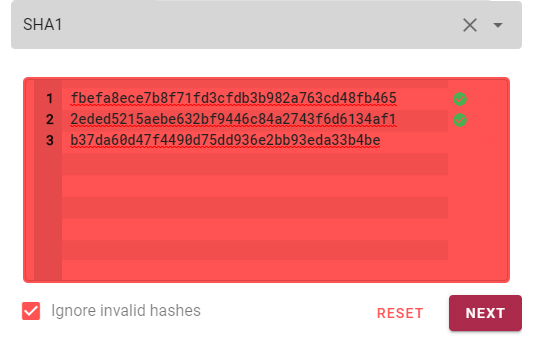

Creating a Job
==============

This chapter will take you through the entire process of creating a cracking job in Webadmin.

<!-- > If you're not familiar with the concept of cracking jobs, see [Jobs](guide/jobs.md) in the introductory chapter first. -->

In this section, we'll first take a look at this process as a whole. The following sections talk about available input options and attack modes in greater detail.

Getting Started with Jobs
-------------------------

When you navigate to the _Add Job_ page, you will see a form split into four distinct steps:

- Input settings – preparing hashes to crack
- Attack settings – configuring an attack method
- Host assignment – planning distribution across compute nodes
- Additional settings – fine tuning and planning

There are two fields above the main form. The name field __is required__, as the job name will serve as an identifier when accessing it later. The template list is optional. Templates can serve as a starting point when creating a job, filling out parts of the form with previously saved values.

Let's take a look at each of the steps of the main form.

> Please note that fields marked with an asterisk are __required__!

Adding Input Hashes
-------------------

In this first step, you input the hashes you want to try to crack. There are three ways to do so:

- Inputting the hashes manually
- Reading hashes from a file you upload
- Extracting from a protected file, like a PDF

The [next section](/jobs/creating/input.md) takes an in-depth look at each of them. Select a method using the toggle button __(1)__ and enter your hashes in the text area __(2)__ or upload your files. Depending on the input method you chose, Fitcrack may be able to automatically detect the type of hash. If not, you have to select it manually from the dropdown __(3)__.

After setting the hash type, each hash is validated. __Green checkmarks__ indicate the hash is valid for this type (algorithm). Hashes that have already been entered into the system and are stored in the cache will have a __yellow exclamation mark__. This is purely informational. Invalid hashes, on the other hand, should not be used in the configuration. If one or more hashes are invalid, the input field is marked __red__ and you won't be able to create the job.

Note that you can override this using the _Ignore invalid hashes_ checkbox that will appear. However, if you do this, there is no guarantee the job will work.

Configuring Attacks
-------------------

In this step, you choose an attack mode and configure it to fit the job. There are a few different attack modes to choose from, each with its own specific setup. You can find all of them, along with a detailed description and examples, in the [Attack modes](/jobs/creating/attacks.md) section.

Once you've set up the attack using valid combination of options, you should be able to create the job, assuming you provided a name for it and valid input in the previous step. But let's not get ahead of ourselves, there are two more steps to look at.

Assigning Hosts
---------------

In this step, you tap into the real potential of the Fitcrack system. The job we've been configuring until now will be distributed between compute nodes, called hosts, based on their measured computing power. You can select which of the hosts currently connected to the system will be participating in the cracking.

> Don't see any hosts in the table? See the guide in the [Host nodes](/guide/hosts.md?id=connecting-hosts) section of the introductory chapter.

The table lists all available hosts. By default, all hosts are selected. To select or deselect a host for taking part in this job, use the checkboxes in the table __(1)__ or use the checkbox in the table header to toggle all. Clicking the name of the host __(2)__ will take you to its detail page. Not all hosts will necessarily be online at the time of creating the job. To see if a host is online or how long ago it was last seen, check the _Online_ column __(3)__. A green power icon indicates the host is available right now.

Tuning the Details
------------------

This is the last step and it's very much optional. Here you can add a comment __(1)__ to the job, which will be visible in the detailed job view. You can also set a time and date for the job to start __(2)__ or leave the checkbox labeled _Immediately_ checked to let the job start when you, well, start it. Simmilarily, you can set a time and date for the job to end __(4)__ or not set any limitation.

The _Desired time per workunit_ field __(3)__ sets how long each workunit (part of the job received by a host) should run on the host node. The default value for this field can also be set on the _Settings_ page.

Finishing up
------------

We have now explored the entire job creation form. There are now two ways forward. You can create a template that will be available in the dropdown described earlier. Note that not all settings from the form are saved to templates, namely input hashes and host assignment. Upon choosing to make a template, you will be prompted for a name (identical to the job name by default). You can continue to work with the form after the template is saved.

The other thing to do is, of course, to create the job. Assuming your settings are valid, the _Create_ (or _Save for later_ in case no hosts are assigned) button will be enabled. After the job is created, you will be taken to the detail view, where you can review it and start it up.
